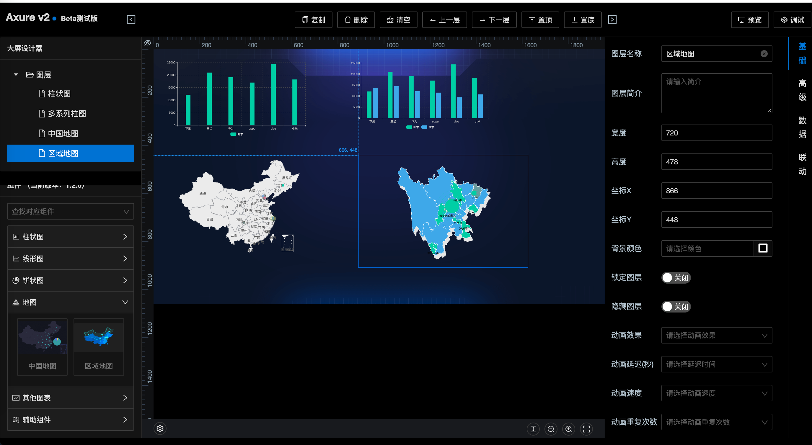
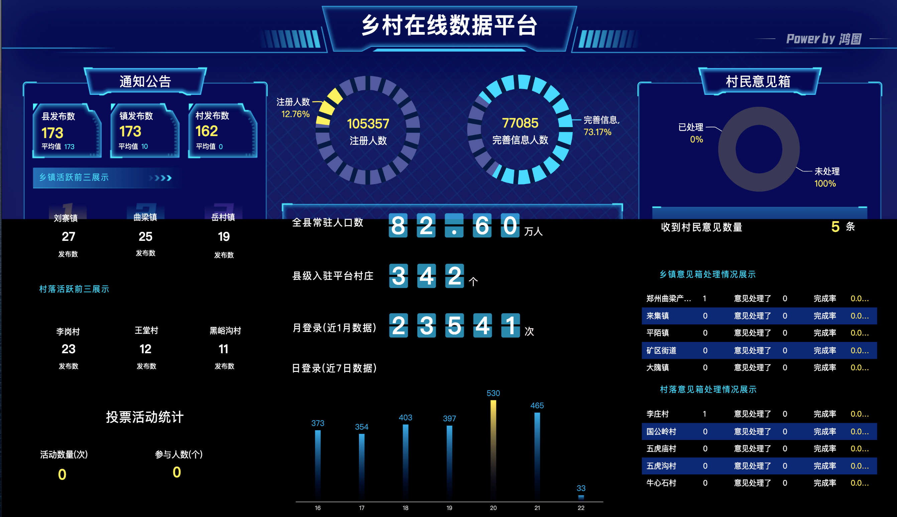

## 可视化大屏项目
### 1.install and start
```
yarn install

yarn start
```

Runs the app in the development mode Open [http://localhost:8081](http://localhost:8081) to view it in your browser.

### 2.designer page



### 3.preview page



